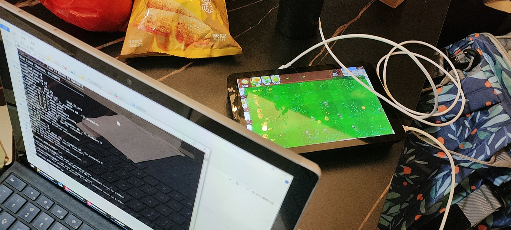

# LVGL简化版植物大战僵尸

## 简介
基于**全志D1H哪吒开发板+1280x800亲儿子MIPI屏幕**, 四舍五入也算是基于RISC-V指令集芯片开发的;
项目目录恰好对应Tina_d1h_sdk下的目录; 目前暂时是一个基于LVGL的简化(陋)但可玩的游戏程序.



### 特性
- 僵尸血量遂游戏时长可能会不断增加;
- 阳光超15个自动捕获;

## 编译说明
1. 在tina-d1-h_v21目录下配置编译环境:
```bash
source build/envsetup.sh 
lunch 2 # 选择:2. d1-h_nezha-tina
```
2. 在tina-d1-h_v21/package/gui/littlevgl-8/lv_examples目录下:
```bash
mm -j
```
3. 复制编译好的程序并打包:
```bash
cp ./out/d1-h-nezha/compile_dir/target/lv_examples/src/lv_examples . && tar zcf lv_examples.tar.gz lv_examples
```

(未完待补充...)

## 参考并鸣谢
- [LVGL_Game_on_ESP32](https://github.com/LHYhorion/LVGL_Game_on_ESP32)

所有图片素材均利用AI技术放大感谢:
- [bigjpg](https://bigjpg.com/)

- [waifu2x](https://www.waifu2x.net/)

注意: 源码中图片素材来源于网络，仅供学习测试，禁止商用，有任何版权纠纷后果自负.